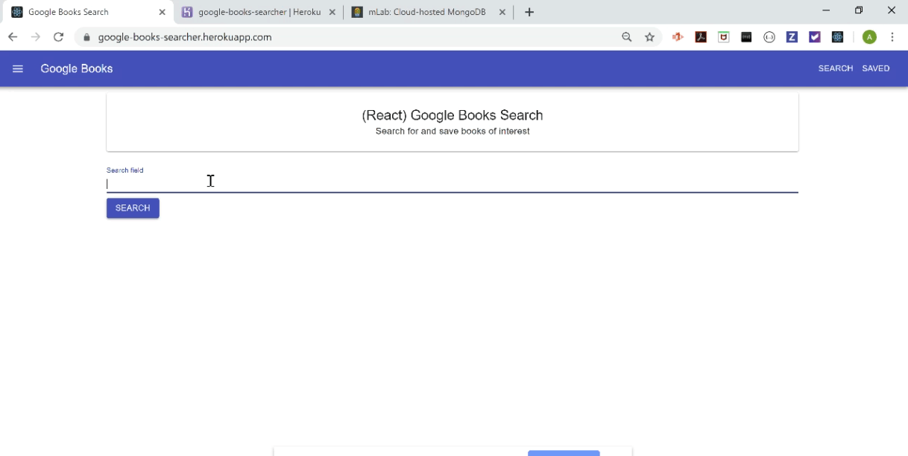

# GoogleBooks
A single page application (SPA) built with React.js and Material UI that allows user to search for books using open Google Books API, and add/delete them from a saved item page, which is stored in Mongo DB.

## Overview
* App.js handles the routing to the two 'pages':
 * The search page uses a React.js form that stores the search term in state, and then uses it to query the server via an axios call. The results are then rendered on the page using a BookCard component built with Material UI.
 * The saved page runs an axios GET request when component mounts to retrieve all saved books from the database, and then renders the results on the page using a SavedBookCard component built with Material UI.
 * onClick callback functions are passed as props into the SavedBookCard and BookCard children components to run axios calls to save or delete the clicked card from the database

## Functionality
